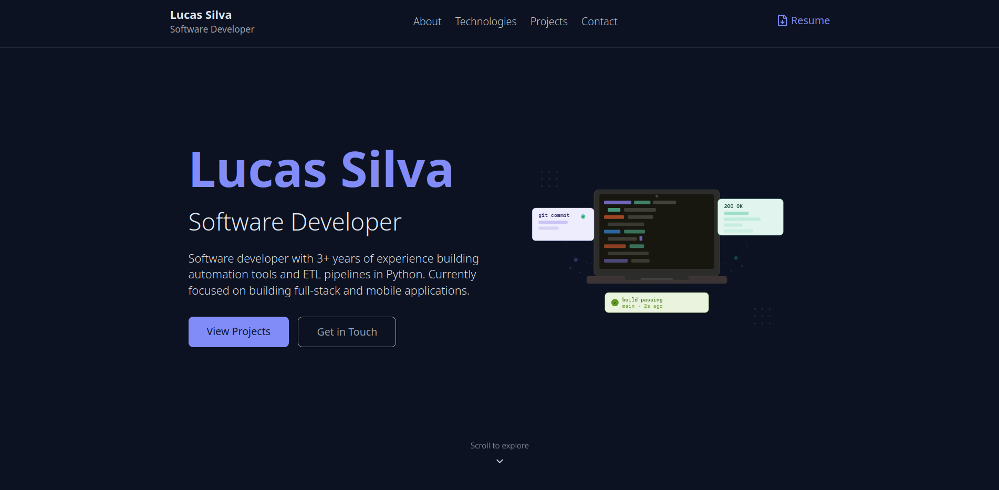

# Lucas Silva - Portfolio Website



This project is my personal portfolio, designed to showcase my projects and skills.

## Tech Stack
- **Framework**: Sveltekit
- **UI**: Svelte
- **Language**: TypeScript
- **Styling**: Tailwind CSS
- **Icons**: Iconify

## Getting Started (Local Development)

The project uses `pnpm` as the package manager.

### Install

```sh
pnpm run install
```

### Run

```sh
pnpm run dev
```

Open http://localhost:5173.

We can also run it via `Docker`:

```sh
docker compose up -d --build
```

Then, open http://localhost:3000.


### Build

To create a production version of the app:

```sh
pnpm run build
```

We can preview the production build with `pnpm run preview`.

### Lint/Format
We're using [oxc](https://oxc.rs/) for linting and formating.

In order to format the code, we can run the following:

```sh
pnpm run fmt:check
pnpm run fmt
```

As for linting, we follow a similar pattern:

```sh
pnpm run lint
pnpm run lint:fix
```

Additionally, we use the `oxc` extension on `VS Code` to format code on save.

## Deployment
This project is manually deployed on a VPS, using `@sveltejs/node-adapter`. A `Dockerfile` and a `docker-compose.yml` file are provided.

The portfolio is live at https://lucasshiva.tech.

## License
This project is licensed under MIT, meaning that you're free to use, modify, sell, or redistribute the source code as long as you keep the copyright notice.
